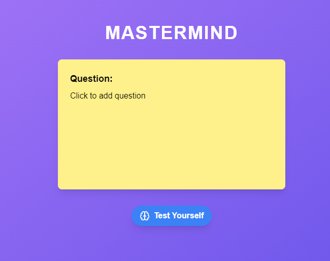

<div align="center">

# AI Empowered Flashcards App

Welcome to the AI Empowered Flashcards App! This app helps you learn better by allowing you to add your knowledge and test it later on. 



## Features

- **Add Knowledge**: Easily create flashcards with the information you want to learn.
- **AI-Powered Testing**: Our AI helps you test your knowledge more effectively.
- **Progress Tracking**: Keep track of your learning progress over time.

## Getting Started

1. **Clone the repository**:
    ```sh
    git clone https://github.com/yourusername/flashcards-app.git
    ```
2. **Install dependencies**:
    ```sh
    cd flashcards-app
    yarn
    ```
3. **Run the app**:
    ```sh
    yarn start
    ```

## License

This project is licensed under nothing as I don't actually care right now!

Happy Learning!
